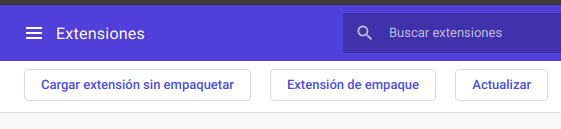
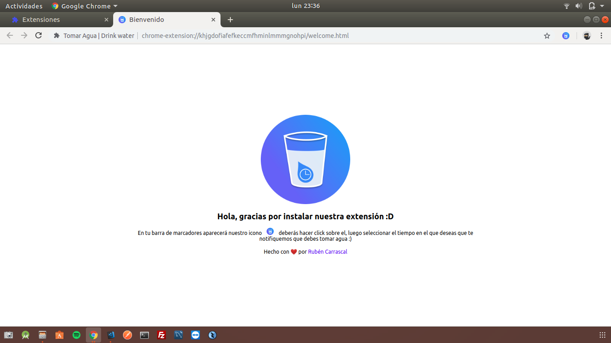
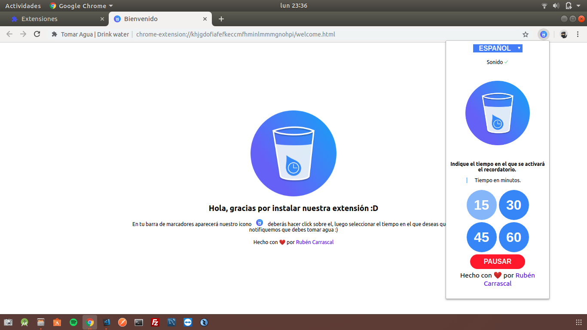

# Tomar Agua | Drink water

> Tomar agua es una extensión para Google Chrome, la cual te ayuda a tener presente la acción de tomar de este preciado líquido mientras estás trabajando en tu PC.

---

### ¿Cómo instalarla?

Clona este repositorio en tu pc, usando git o descargando el .zip y una vez lo tengas descargado procede a descomprimirlo. Ahora deberás navegar hasta `chrome://extensions` y activar la siguiente opción: 

Una vez lo hayas activado, ahora deberás darle click al botón **cargar extensión sin empaquetar** y navegar hasta la ruta en la que descomprimiste la extensión

Como parte final la extensión se instalará y ejecutará. Ahora sólo deberás seguir los pasos indicados en la extensión.

### Capturas

---

Si tienes algo que agregar, envíame un pull request. Si tienes problemas abre uno aquí y estaré pendiente :D

> Próximamente la podrás conseguir en la **Web Store**

Hecho con ❤️ por [Rubén Carrascal](https://krrskl.github.io/)
